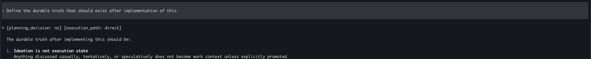
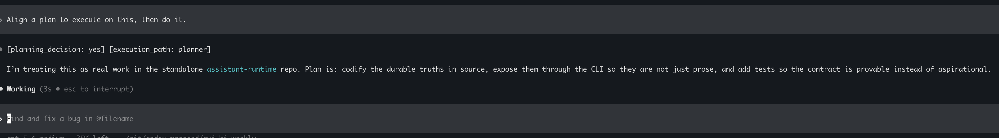

# Loops And Runtime Model

This file carries the deeper modeling and loop-specific detail behind the runtime story.

## Runtime Model

In this project, the runtime is a small embedded governed runtime that runs inside the host machine runtime.

That means:

- the operating system is the outer runtime
- `assistant-runtime` is an inner runtime for agent execution
- chat is not the runtime; it is only one input surface
- the runtime owns durable state, routing, policy, and declared resources

Technically, it is:

- a native CLI process
- a local state model under `.runtime/`
- a governed contract in `governed-runtime.json`
- routing logic for orchestrator, queue, and worker behavior
- proof/reporting surfaces that explain what happened

This runtime model keeps those lanes separate:

- ideation can stay lightweight without automatically mutating execution state
- loop execution can read and write durable local state under `.runtime/`
- host and OS actions become explicit, inspectable runtime surfaces
- packaged runtime types make it easier to expose only the lane you actually want
- the foreground orchestrator only accepts and routes; background workers own direct and planner execution below the chat lane

## Agentic Runtime Model

The intended runtime vocabulary is:

- `User`
- `Orchestrator`
- `Task Queue`
- `Direct Worker`
- `Planner Worker`
- `Runtime Resources`

The orchestrator stays in the foreground and never executes user work directly. It accepts intent, assigns a durable task id, and routes work into the task queue.

## Implemented Runtime Surfaces

This repository currently implements:

- `assistant.runtime`
- `assistant.runtime.loop`
- `assistant.runtime.host`
- `assistant.runtime.os`

These runtime types are declared but intentionally not implemented in this build:

- `assistant.runtime.conversation`
- `assistant.runtime.governance`
- `assistant.runtime.registry`

## Planning Status

The default planning status format is:

```text
[planning_decision: no] [execution_path: direct]
```

or:

```text
[planning_decision: yes] [execution_path: planner]
```

You can render it directly:

```bash
assistant-runtime planning status
assistant-runtime planning status --multi-step
assistant-runtime planning status --mutates-real-state --has-dependencies
```

## Durable Truth And Resources

The runtime can print its durable-truth and managed-resource surfaces:

```bash
assistant-runtime runtime durable-truth
assistant-runtime runtime implementation-plan
assistant-runtime runtime managed-resources
assistant-runtime runtime list-resources
assistant-runtime runtime provenance
```

The resource substrate persists under `.runtime/resources/`:

- `catalog.json`
- `mounts.json`
- `provenance.json`

## Chat Handoff Model

Foreground chat does not execute direct work itself.

Current flow:

```text
Chat -> assistant.runtime.conversation -> assistant.runtime.task_queue -> worker -> normal flow
```

Durable state:

- `.runtime/chat/state.json`
- `.runtime/queue-lane/tasks.json`
- `.runtime/workers/direct/tasks.json`
- `.runtime/workers/planner/tasks.json`

## Path Examples

Direct path:



```text
[planning_decision: no] [execution_path: direct]
```

Planner path:



```text
[planning_decision: yes] [execution_path: planner]
```
